# 🫀  IBM ML Course 3 — Heart Disease Classification (UCI)

Multi-class classification of heart disease severity (`num` = 0–4) using the UCI Heart Disease dataset (Kaggle cleaned).  
Built in Google Colab with scikit-learn, XGBoost, imbalanced-learn, and SHAP.

---

## 📌 What this repo contains (and matches IBM Course 3 requirements)

- **Dataset description & objectives**
- **EDA** (distributions, correlations, class imbalance)
- **Preprocessing** (missing values, encoding, scaling)
- **Modeling:** Logistic Regression, Random Forest, XGBoost
- **Evaluation:** accuracy, precision/recall/F1, **confusion matrices**
- **Improvements:** **SMOTE**, hyperparameter tuning, **stacking ensemble**
- **Interpretability:** **SHAP** (global + per-class + per-sample)
- **Insights & next steps**
- **PDF-friendly report sections** for submission

---

## 🧭 Workflow

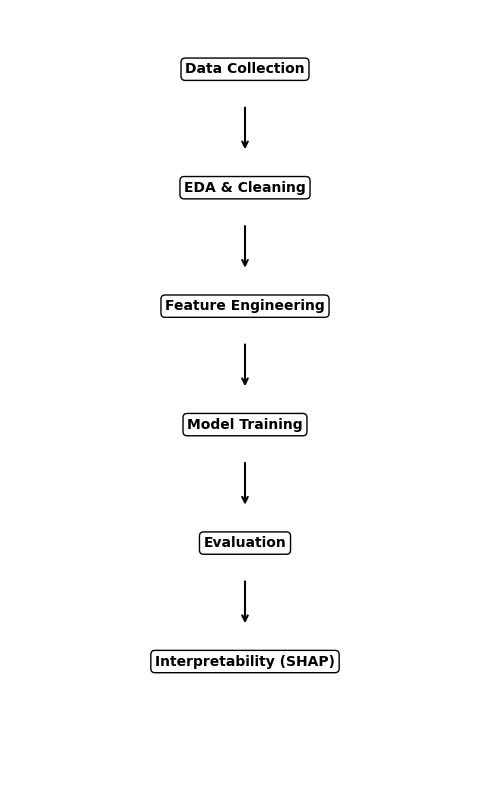

---

## 🗂 Dataset & Objective

- **Source:** UCI Heart Disease (Kaggle curated)
- **Rows/Cols:** ~920 × 16 (after cleaning)
- **Target:** `num` (0–4)
- **Goal:** Predict presence/severity of heart disease; understand key drivers.

---

## 🔎 Exploratory Data Analysis (EDA)

**Target distribution**

**Correlation map (numeric features)**

**General EDA snapshot**

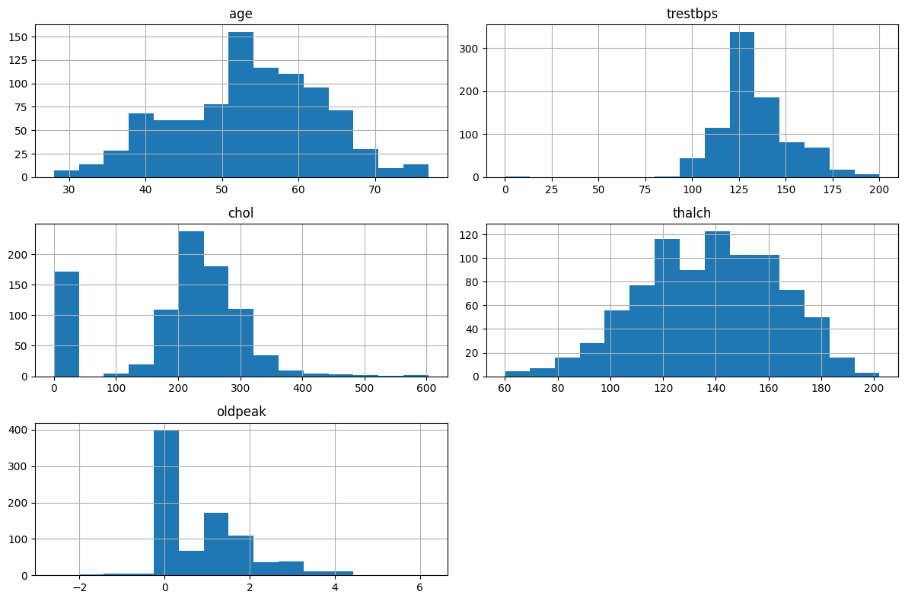

---

## 🤖 Models Trained

- **Logistic Regression** (baseline, one-vs-rest)
- **Random Forest** (ensemble, non-linear)
- **XGBoost** (gradient boosting)

### Confusion Matrices (Test Set)

**Logistic Regression**
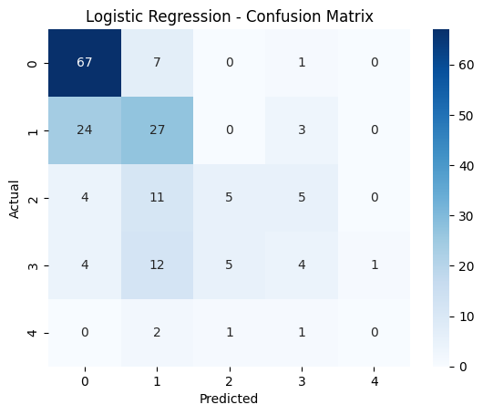

**Random Forest**
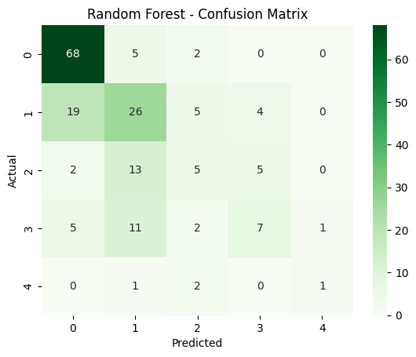

**XGBoost**
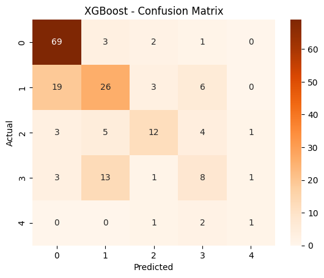

**Stacking (after SMOTE + tuning)**
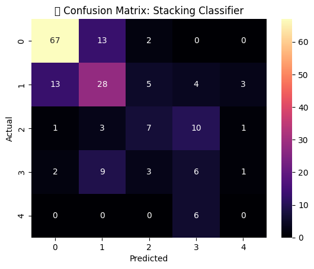

---

## ⚙️ Model Improvements

- **Class imbalance:** SMOTE on training split  
- **Hyperparameter tuning:** GridSearchCV for RF & XGB  
- **Ensemble:** Stacking (LR + RF + XGB → meta LR)

---

## 🧠 Model Interpretability (SHAP)

### Beeswarm — Per Class
- **Class 0**
  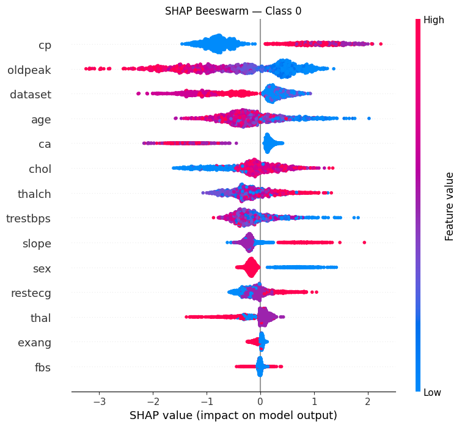
- **Class 1**
  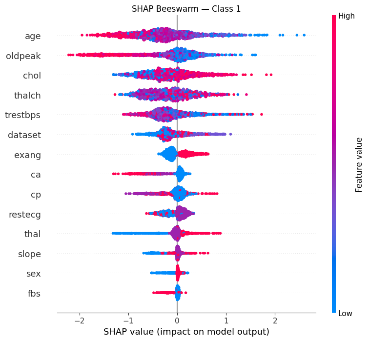
- **Class 2**
  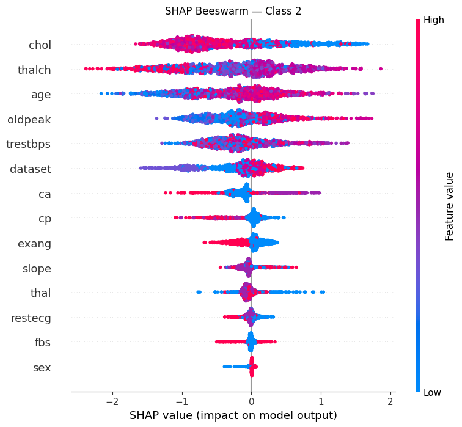
- **Class 3**
  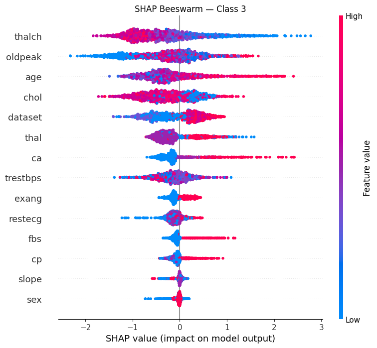
- **Class 4**
  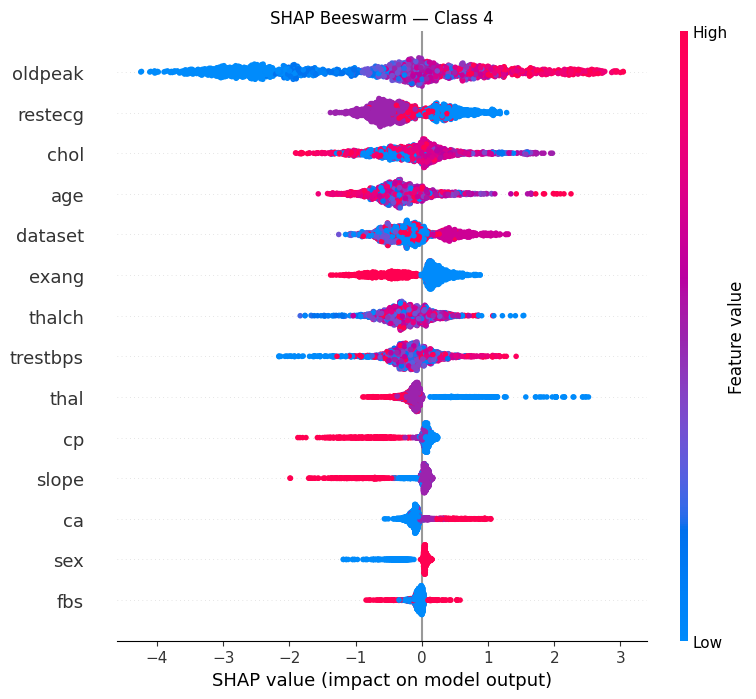

### Global SHAP Importance
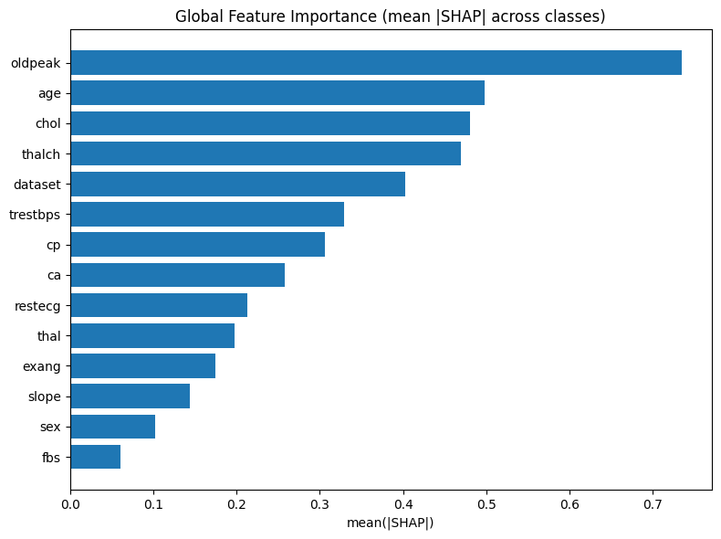

### Example Local Explanation (Waterfall, Class 1)
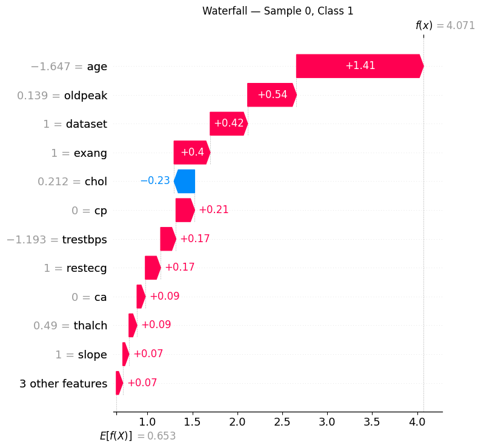

### Top Features per Class (mean |SHAP|)
- **Class 0**
  
- **Class 1**
  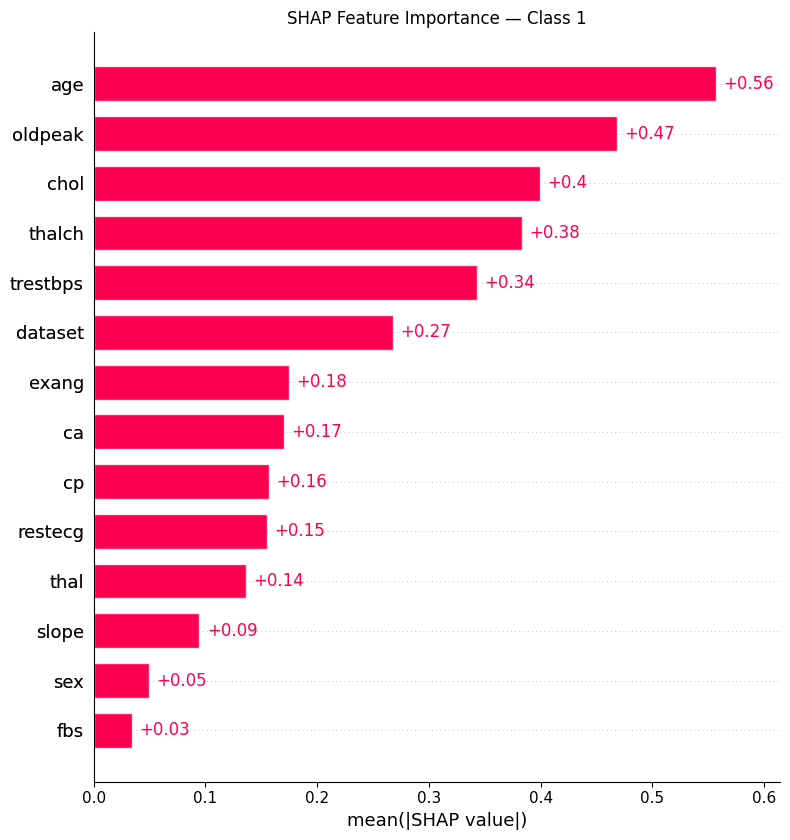
- **Class 2**
  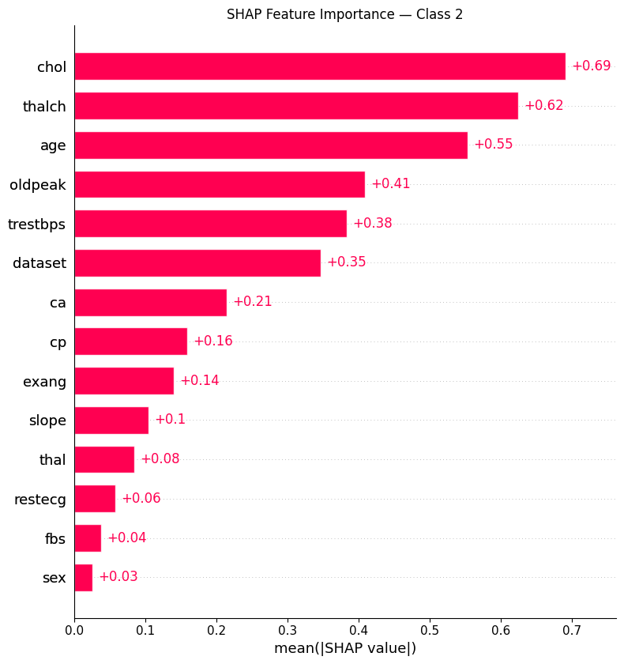
- **Class 3**
  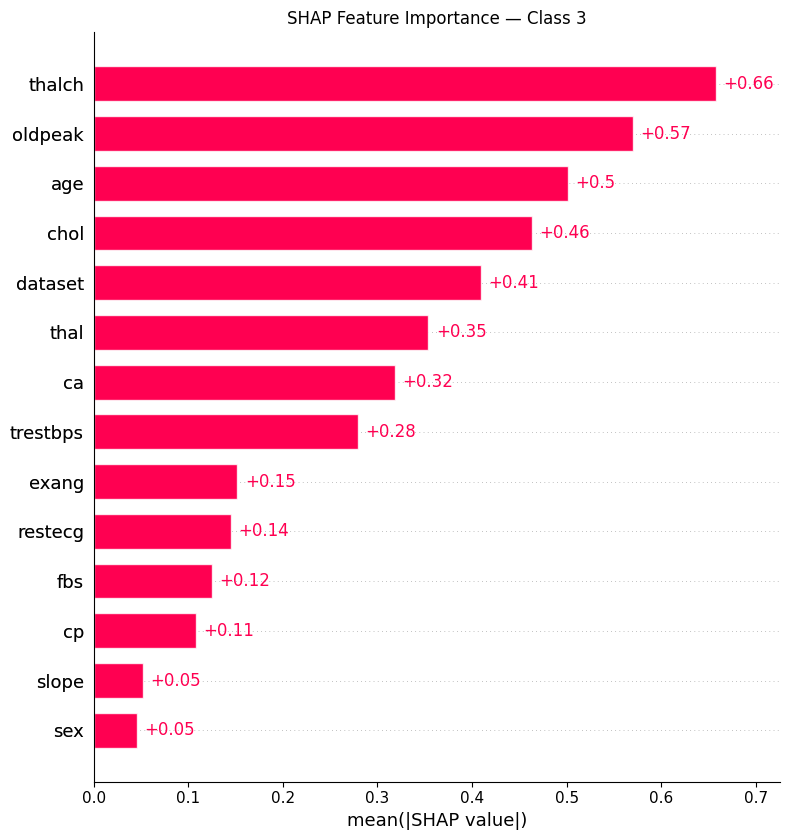
- **Class 4**
  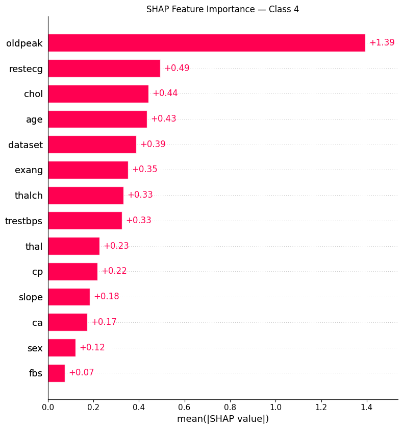

---

## 📈 Key Findings

- **oldpeak**, **thalach**, **age**, **chol** consistently rank among top predictors.
- SMOTE improves recall for minority classes (2–4).
- Tree/boosting models outperform linear baseline; stacking gives stable gains.
- SHAP confirms domain logic (ECG/angina/age/oldpeak strongly influence risk).

---

## 🧭 Next Steps

- Try **cost-sensitive learning** (class weights) in addition to SMOTE.
- Calibrate probabilities; add **macro-F1** as selection metric.
- External validation; expand features (e.g., meds, family history).
- Package as an **API / Streamlit** triage tool.

---

## 🧾 IBM Course 3 Submission Checklist (Completed ✅)

- [x] Data description & objective  
- [x] EDA (plots + class balance)  
- [x] Three classifiers (LR, RF, XGB)  
- [x] Common split/CV & metrics  
- [x] Model selection + rationale  
- [x] Improvements (SMOTE, tuning, stacking)  
- [x] Interpretability (SHAP)  
- [x] Insights + next steps  
- [x] PDF-friendly report  

---
## 🛠 Tech Stack

`python`, `pandas`, `numpy`, `scikit-learn`, `xgboost`, `imbalanced-learn`, `shap`, `matplotlib`, `seaborn`

---
